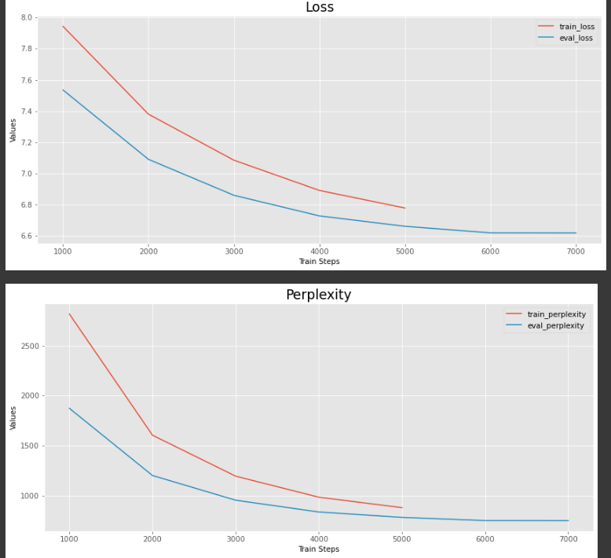

# Project Description

* The main focus of the project is to create word vectors and language models for Amharic, an official Semitic language spoken primarily in Ethiopia. Amharic is the 2nd most spoken Semitic language in the world, after Arabic, and is the official language of Ethiopia. 

* The ultimate objective is to use these resources for different downstream tasks, such as classification, Named Entity Recognition, and language generation. The aim is to create the best possible language models and word vectors that are able to represent the semantic and syntactic connections between words in the Amharic language. This will significantly aid in natural language processing tasks involving the Amharic language and contribute to the advancement of NLP research for low-resource languages.
### Amharic word2vec( link to the  [TensorBoard](https://projector.tensorflow.org/?config=https://gist.githubusercontent.com/kidist-amde/26520c4a39972c50808e35b9caa284a9/raw/d94fdc5708f0392d2623a08c7a7166dedf069af8/config.json))

### Train plot

